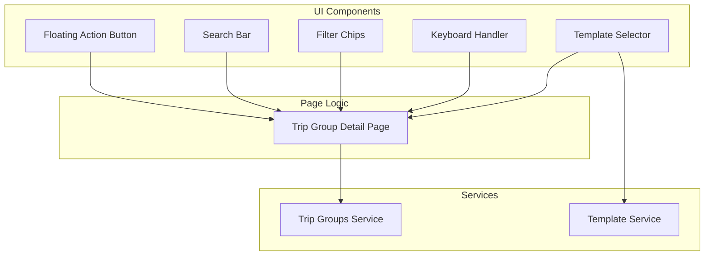

# Design Document: Trip Groups UX Enhancements

## Overview

This design enhances the Trip Groups feature with improved UX patterns including a floating action button, quick expense templates, enhanced search/filter capabilities, and keyboard shortcuts for power users.

## Architecture



## Components and Interfaces

### 1. Expense Template Service (`expense-templates-service.js`)

```javascript
class ExpenseTemplatesService {
  // Get all default templates
  getDefaultTemplates() → [Template]
  
  // Get template by ID
  getTemplate(templateId) → Template
  
  // Apply template to expense form
  applyTemplate(templateId, formData) → ExpenseData
}

interface Template {
  id: string,
  name: string,
  icon: string,
  category: string,
  descriptionPrefix: string,
  splitType: 'equal' | 'custom' | 'percentage',
  defaultAmount?: number
}
```

### 2. Enhanced Trip Group Detail Page

```javascript
class TripGroupDetailPage {
  // Existing methods...
  
  // New methods for UX enhancements
  initializeFAB() → void
  initializeTemplates() → void
  initializeSearch() → void
  initializeFilters() → void
  initializeKeyboardShortcuts() → void
  
  // Template handling
  showTemplateSelector() → void
  applyTemplate(templateId) → void
  
  // Search and filter
  handleSearch(query) → void
  applyFilter(filterType, value) → void
  clearFilters() → void
  
  // Keyboard shortcuts
  handleKeyPress(event) → void
  showShortcutsHelp() → void
}
```

## Data Models

### ExpenseTemplate

```javascript
{
  id: string,
  name: string,
  icon: string,              // Emoji or icon identifier
  category: string,          // Trip category
  descriptionPrefix: string, // Default description text
  splitType: 'equal' | 'custom' | 'percentage',
  suggestedAmount?: number   // Optional suggested amount
}
```

### Default Templates

```javascript
const DEFAULT_TEMPLATES = [
  {
    id: 'hotel',
    name: 'Hotel Stay',
    icon: '🏨',
    category: 'Accommodation',
    descriptionPrefix: 'Hotel - ',
    splitType: 'equal'
  },
  {
    id: 'taxi',
    name: 'Taxi/Uber',
    icon: '🚕',
    category: 'Transport',
    descriptionPrefix: 'Taxi - ',
    splitType: 'equal'
  },
  {
    id: 'restaurant',
    name: 'Restaurant',
    icon: '🍽️',
    category: 'Food & Dining',
    descriptionPrefix: 'Meal at ',
    splitType: 'equal'
  },
  {
    id: 'groceries',
    name: 'Groceries',
    icon: '🛒',
    category: 'Food & Dining',
    descriptionPrefix: 'Groceries - ',
    splitType: 'equal'
  },
  {
    id: 'activity',
    name: 'Activity/Tour',
    icon: '🎭',
    category: 'Activities',
    descriptionPrefix: 'Activity - ',
    splitType: 'equal'
  },
  {
    id: 'flight',
    name: 'Flight/Train',
    icon: '✈️',
    category: 'Transport',
    descriptionPrefix: 'Travel - ',
    splitType: 'custom'
  },
  {
    id: 'shopping',
    name: 'Shopping',
    icon: '🛍️',
    category: 'Shopping',
    descriptionPrefix: 'Shopping - ',
    splitType: 'equal'
  }
];
```

## UI Components

### 1. Floating Action Button (FAB)

**Position**: Fixed bottom-right (desktop: 32px from edges, mobile: 16px from edges)
**Size**: 56px × 56px
**Color**: Primary brand color with shadow
**Icon**: Plus (+) symbol
**Behavior**: 
- Visible when scrolling
- Hidden when expense form is open
- Hidden when group is archived
- Smooth fade-in/out animations

### 2. Template Selector

**Display**: Horizontal scrollable chips above expense form
**Layout**: Icon + Name in each chip
**Interaction**: Click to apply template
**Visual**: Highlighted border when selected

### 3. Search Bar

**Position**: Top of expenses tab
**Features**:
- Real-time search as user types
- Clear button (X) when text is entered
- Placeholder: "Search expenses..."
- Debounced input (300ms delay)

### 4. Filter Chips

**Position**: Below search bar
**Chips**:
- "My Expenses" - Shows only expenses paid by or split with current user
- "Last 7 Days" - Date filter
- "Last 30 Days" - Date filter
- Category chips (dynamic based on group categories)
**Behavior**:
- Toggle on/off
- Multiple filters can be active
- "Clear All" button appears when filters are active

### 5. Keyboard Shortcuts Overlay

**Trigger**: "?" button or "?" key
**Display**: Modal overlay with shortcut list
**Shortcuts**:
- E: Add Expense
- S: Settle Up
- M: Add Member
- Esc: Close form/modal
- ?: Show shortcuts help

## Error Handling

### Validation Errors
- Empty template selection → No action taken
- Invalid search query → Show all results
- Filter with no results → Show empty state with clear message

### Edge Cases
- FAB on small screens → Adjust position to avoid navigation
- Multiple active filters → Show count badge
- Search with special characters → Sanitize input
- Keyboard shortcuts in input fields → Ignore shortcuts

## Testing Strategy

### Unit Tests
- Template service returns correct templates
- Search filters expenses correctly
- Filter combinations work as expected
- Keyboard shortcuts trigger correct actions

### Integration Tests
- FAB opens expense form
- Template applies values to form
- Search updates expense list
- Filters combine correctly
- Keyboard shortcuts work end-to-end

### Usability Tests
- FAB is easily discoverable
- Templates speed up expense entry
- Search is intuitive
- Filters are clear and useful
- Shortcuts are discoverable

