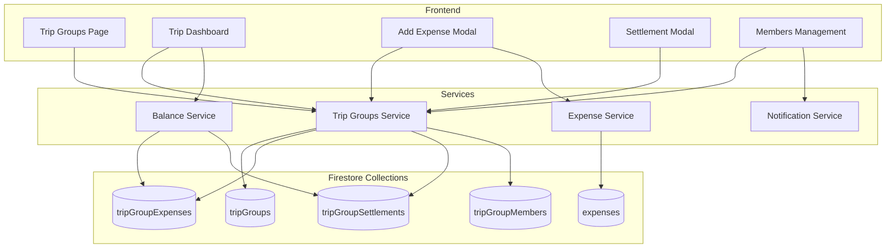

# Design Document: Trip Groups

## Overview

The Trip Groups feature enables users to create temporary expense-sharing groups for trips or events. It integrates with the existing personal expense tracking system, allowing expenses to be recorded both personally and within the group context. The feature includes balance tracking, debt simplification, settlement recording, budget planning, and notifications for non-Rupiya users.

## Architecture



## Components and Interfaces

### 1. Trip Groups Service (`trip-groups-service.js`)

```javascript
class TripGroupsService {
  // Group CRUD
  async createGroup(groupData) → { success, groupId, error }
  async getGroup(groupId) → { success, data, error }
  async updateGroup(groupId, updates) → { success, error }
  async archiveGroup(groupId) → { success, error }
  async getUserGroups(userId) → [TripGroup]
  
  // Member Management
  async addMember(groupId, memberData) → { success, memberId, error }
  async removeMember(groupId, memberId) → { success, error }
  async getGroupMembers(groupId) → [Member]
  
  // Expense Management
  async addGroupExpense(groupId, expenseData) → { success, expenseId, error }
  async getGroupExpenses(groupId, filters?) → [GroupExpense]
  async deleteGroupExpense(groupId, expenseId) → { success, error }
  
  // Settlement Management
  async recordSettlement(groupId, settlementData) → { success, settlementId, error }
  async getSettlements(groupId) → [Settlement]
  
  // Budget Management
  async setBudget(groupId, budgetData) → { success, error }
  async getBudgetStatus(groupId) → BudgetStatus
}
```

### 2. Balance Service (`balance-service.js`)

```javascript
class BalanceService {
  // Calculate balances for all members
  calculateBalances(expenses, settlements, members) → Map<memberId, balance>
  
  // Simplify debts to minimize transactions
  simplifyDebts(balances) → [{ from, to, amount }]
  
  // Get balance for specific member
  getMemberBalance(groupId, memberId) → number
  
  // Check if group is fully settled
  isFullySettled(balances) → boolean
}
```

### 3. Notification Service (`notification-service.js`)

```javascript
class NotificationService {
  // Send WhatsApp/SMS to non-Rupiya users
  async sendExpenseNotification(phoneNumber, expenseDetails, balance) → { success, error }
  async sendSettlementNotification(phoneNumber, settlementDetails, balance) → { success, error }
  async sendBudgetWarning(members, budgetStatus) → { success, error }
}
```

## Data Models

### TripGroup

```javascript
{
  id: string,
  name: string,
  description: string,
  startDate: Timestamp,
  endDate: Timestamp,
  createdBy: string,           // userId of creator
  createdAt: Timestamp,
  updatedAt: Timestamp,
  status: 'active' | 'archived' | 'completed',
  budget: {
    total: number,
    categories: {              // Optional per-category budgets
      [categoryName]: number
    }
  },
  categories: string[],        // Trip-specific categories
  memberCount: number,
  totalExpenses: number        // Denormalized for quick display
}
```

### TripGroupMember

```javascript
{
  id: string,
  groupId: string,
  userId: string | null,       // null for non-Rupiya users
  name: string,
  email: string | null,
  phone: string | null,
  isAdmin: boolean,
  isRupiyaUser: boolean,
  notificationsEnabled: boolean,
  joinedAt: Timestamp,
  inviteStatus: 'pending' | 'accepted' | 'declined'
}
```

### TripGroupExpense

```javascript
{
  id: string,
  groupId: string,
  description: string,
  amount: number,
  category: string,
  date: Timestamp,
  paidBy: string,              // memberId who paid
  splitType: 'equal' | 'custom' | 'percentage',
  splits: [
    {
      memberId: string,
      amount: number,          // For custom split
      percentage: number       // For percentage split
    }
  ],
  linkedExpenseId: string | null,  // Reference to personal expense
  addedBy: string,             // userId who added
  createdAt: Timestamp
}
```

### TripGroupSettlement

```javascript
{
  id: string,
  groupId: string,
  fromMemberId: string,        // Who paid
  toMemberId: string,          // Who received
  amount: number,
  date: Timestamp,
  notes: string,
  recordedBy: string,          // userId who recorded
  createdAt: Timestamp
}
```

## Correctness Properties

*A property is a characteristic or behavior that should hold true across all valid executions of a system—essentially, a formal statement about what the system should do. Properties serve as the bridge between human-readable specifications and machine-verifiable correctness guarantees.*

### Property 1: Group Creation Sets Creator as Admin
*For any* valid group creation request, the creator should be automatically added as a member with admin privileges.
**Validates: Requirements 1.2**

### Property 2: Non-User Member Placeholder Creation
*For any* member added with contact info who is not a Rupiya user, a placeholder member record should be created with their contact information stored.
**Validates: Requirements 1.4, 9.1**

### Property 3: Expense Integration - Personal Record Creation
*For any* group expense where the current user paid, a corresponding personal expense record should be created with the full amount and a reference to the group.
**Validates: Requirements 2.1, 8.1**

### Property 4: Split Calculation Correctness
*For any* expense with any split type (equal, custom, percentage), the sum of all member shares should equal the total expense amount.
**Validates: Requirements 2.4, 2.5**

### Property 5: Balance Conservation Invariant
*For any* trip group at any point in time, the sum of all member balances should equal zero (money is conserved within the group).
**Validates: Requirements 2.6, 3.2**

### Property 6: Settlement Balance Update
*For any* settlement recorded between two members, the payer's balance should decrease and the receiver's balance should increase by exactly the settlement amount.
**Validates: Requirements 4.1, 4.3**

### Property 7: Fully Settled Detection
*For any* trip group where all member balances are zero, the group should be marked as "Fully Settled" (or "Completed" if archived).
**Validates: Requirements 4.4, 7.4**

### Property 8: History Chronological Order
*For any* trip group, the expense and settlement history should be sorted in chronological order by date.
**Validates: Requirements 5.1**

### Property 9: History Filter Correctness
*For any* filter criteria (date range, category, member), the filtered results should only contain items matching all specified criteria.
**Validates: Requirements 5.3**

### Property 10: Member Removal Balance Constraint
*For any* member removal attempt, removal should only succeed if the member's balance is zero; otherwise it should be rejected.
**Validates: Requirements 6.2, 6.3, 6.4**

### Property 11: Archived Group Expense Prevention
*For any* archived trip group, attempts to add new expenses should be rejected.
**Validates: Requirements 7.2**

### Property 12: Linked Expense Deletion Cascade
*For any* group expense deletion, the linked personal expense should also be deleted.
**Validates: Requirements 8.4**

### Property 13: Default Trip Categories
*For any* newly created trip group, the default categories (Accommodation, Transport, Food & Dining, Activities, Shopping, Tips, Other) should be present.
**Validates: Requirements 10.1**

### Property 14: Category Breakdown Sum
*For any* trip group with expenses, the sum of expenses by category should equal the total group expenses.
**Validates: Requirements 10.3**

### Property 15: Budget Progress Calculation
*For any* trip group with a budget set, the progress percentage should equal (total expenses / budget) * 100.
**Validates: Requirements 11.2**

### Property 16: Budget Warning Threshold
*For any* trip group where expenses reach or exceed 80% of budget, a warning should be triggered.
**Validates: Requirements 11.3**

### Property 17: Budget Overspend Detection
*For any* trip group where expenses exceed the budget, the overspend amount should equal (total expenses - budget).
**Validates: Requirements 11.4**

## Error Handling

### Validation Errors
- Empty group name → Display "Group name is required"
- Invalid expense amount (≤0) → Display "Amount must be greater than zero"
- Invalid phone number → Display "Invalid phone number format"
- Split amounts don't sum to total → Display "Split amounts must equal total"

### Permission Errors
- Non-admin tries to remove member → Display "Only admins can remove members"
- Non-admin tries to archive group → Display "Only admins can archive groups"
- Adding expense to archived group → Display "Cannot add expenses to archived groups"

### Balance Errors
- Removing member with non-zero balance → Display "Member must settle balance before leaving"
- Settlement exceeds debt → Display warning but allow transaction

### Network Errors
- Notification delivery failure → Log error, continue operation, show warning to user

## Testing Strategy

### Unit Tests
- Balance calculation functions
- Debt simplification algorithm
- Split calculation for each type (equal, custom, percentage)
- Budget threshold detection

### Property-Based Tests
Using a property-based testing library (e.g., fast-check for JavaScript):

1. **Balance Conservation**: Generate random sequences of expenses and settlements, verify balances always sum to zero
2. **Split Correctness**: Generate random amounts and participant counts, verify splits sum to total
3. **Chronological Ordering**: Generate random dated transactions, verify sorting
4. **Filter Correctness**: Generate random expenses and filters, verify filter results

### Integration Tests
- Create group → Add members → Add expenses → Verify balances
- Add expense → Verify personal expense created
- Record settlement → Verify balance updates
- Archive group → Verify expense addition blocked

### Configuration
- Minimum 100 iterations per property test
- Tag format: **Feature: trip-groups, Property {number}: {property_text}**
